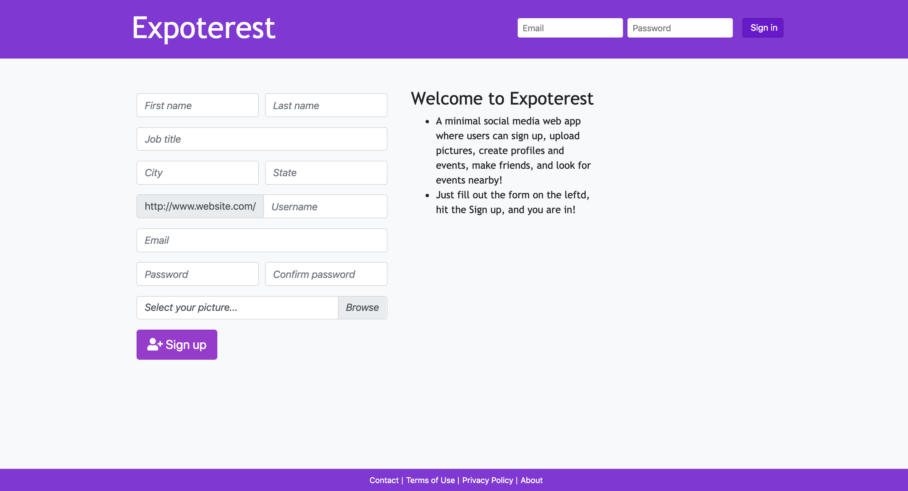

# :link: Me on GitHub
* My [profile](https://github.com/Arsalan-Sadri)
  * All repositories, source codes, READMEs, pull requests, commits, issues, and...
* My [portfolio](https://Arsalan-Sadri.github.io)
  * Find all deployed applications. 

# :page_with_curl: Description
* A minimal social media web app where users can sign up, upload pictures, create profiles and events, make friends, and look for events nearby!
* At the beginning, users need to sign up. 
* To do so, they need to enter their basic information, upload a profile picutre, choose a username and password, and create an account.
* Having singed up, they can then sign in using their credentials from now on. 
* Users can modify their account as they wish after being created  
* Users can upload multiple photos and create albums 
* Users can create events
* Users can modify and/or delete events they have created
* Users can RSVP to other users' events or cancel their RSVP
* Users can make friends or unfriend with other users 

* Home page prior to sign in or sign up

* Home page after sign in

# :nut_and_bolt: Tools and Technologies
* Languages, libraries, and frameworks: `HTML`, `CSS`, `JavaScript`, `React`, `Bootstrap`
* Application Server: `Node.js` runtime environment
* Database Server: `MongoDB`
* Dependencies: `axios`, `bcrypt`, `body-parser`, `dotenv`, `express`, `express-fileupload`, `if-env`, `jsonwebtoken`, `mongoose`, `morgan`, `multer`, `react-modal`
* Package Manager: `npm`, `yarn`
* Version control: `Git`
* Editor: `Visual Studio Code`
* Operating System: `Mac OS`

# :arrow_forward: Deployed Application
* See the [application]() up and running via GitHub Pages directly from its depository.

# :tv: Demo
* [Here]() see a short demo of this application on my YouTube channel!

# :wrench: How to Run
In order to run the application on your device, follow the instructions given below:
1. **Clone down** the application to your local device
   1. Click on the green button above "Clone or download"
   2. ...
2. **Install modules** 
   * To install modules specified in `package.json`, run the following command in your terminal
      * via npm: `$ npm i`
      * via yarn: `$ yarn`
3. Get your **database** up and running.
4. You may run the application in either of following modes:
   * Development mode
     * Run the application by `$ yarn start`
   * Production mode
     * Run the application by  

# :key: Technical Highlights
1. ...